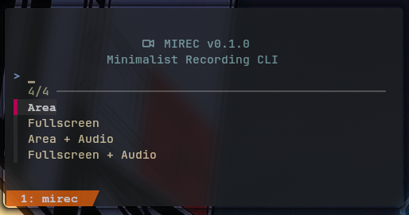
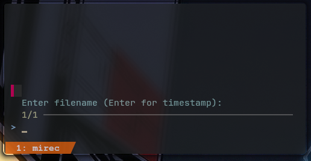

# MIREC (Minimalist Recorder)
[v0.1.0]

I created this for my fanless m3 laptop. Heavy GUI recording apps like OBS or even some "lightweight" GTK wrappers were pushing my temps high enough to trigger thermal throttling. I needed something that stayed out of the way, used zero resources when idle, and offloaded everything to the Intel VA-API hardware. 
I on't think it's perfect, but it suits my needs for screen recording at the moment.

MIREC is a minimalist TUI wrapper for `wf-recorder` designed for Wayland (Hyprland). It provides a quick `fzf` interface for area or fullscreen capture with optional audio.

<p align="center">
  
</p>
<p align="center">
  
</p>

**Installation**

```zsh
git clone https://github.com/Rakosn1cek/mirec.git
cd mirec
chmod +x mirec
```
**Dependencies**
You will need these installed on your system:

- `wf-recorder` (the engine)
- `slurp` (for area selection)
- `fzf` (for the TUI menu)
- `libnotify` (for start/stop notifications)
- `intel-media-driver` (recommended for iHD hardware acceleration)

**Usage**
Run the script directly or bind it to a Hyprland keybind:

`./mirec`

**Waybar Integration**

Add this to your config:

```zsh
"custom/recorder": {
        "format": "{}",
        "interval": 1,
        "return-type": "json",
        "exec": "if pgrep -x wf-recorder > /dev/null; then echo '{\"text\": \"  REC\", \"class\": \"recording\"}'; else echo '{\"text\": \"  IDLE\", \"class\": \"idle\"}'; fi",
        "on-click": "kitty -T 'Mirec' bash -c '/home/rk1/arch-projects/video-recording/mirec'",
        "on-click-right": "pkill -SIGINT wf-recorder && rm -f /tmp/mirec.pid",
        "tooltip": false
    },
```

And your style.css:

```zsh
#custom-recorder {
    color: #ff5555; /* Red when waiting */
}

#custom-recorder.recording {
    color: #50fa7b; /* Green when active */
}

#custom-recorder {
    margin: 0 5px;
}
```

**Thermal Performance**

On my fanless system, recording 1080p @ 60fps keeps CPU load under 5%. The Intel HD Graphics handles the heavy lifting via /dev/dri/renderD128, preventing the system from throttling during long sessions.

**Quality and Scaling**

MIREC records at a 1:1 pixel ratio. If you record a small area and then view it fullscreen, your player will stretch the image and make it look "zoomed" or blurry. For native sharpness, view the output at its original size or use the `Alt++` or `Alt--` key in mpv.

### License

This project is licensed under the MIT License - see the [LICENSE](LICENSE) file for details.
